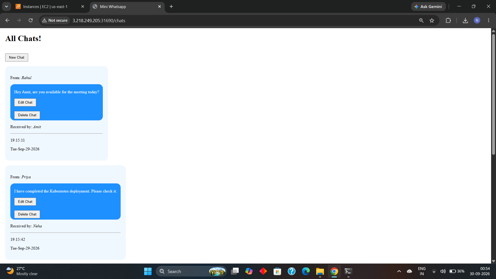
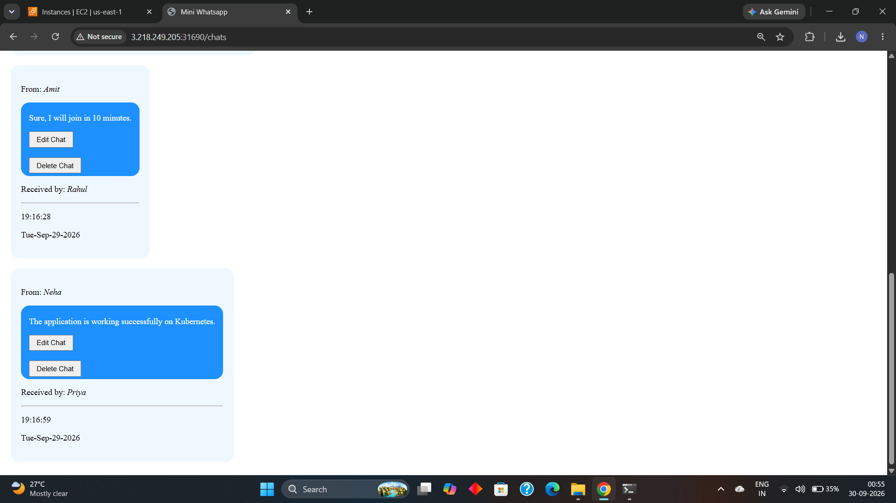
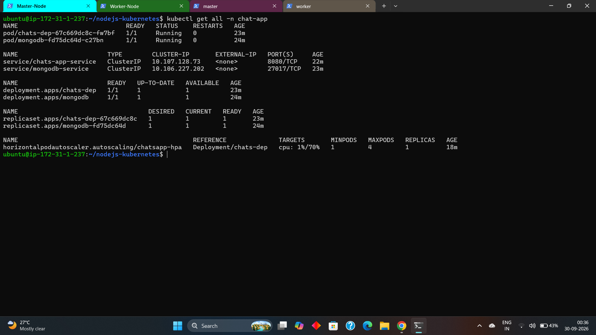
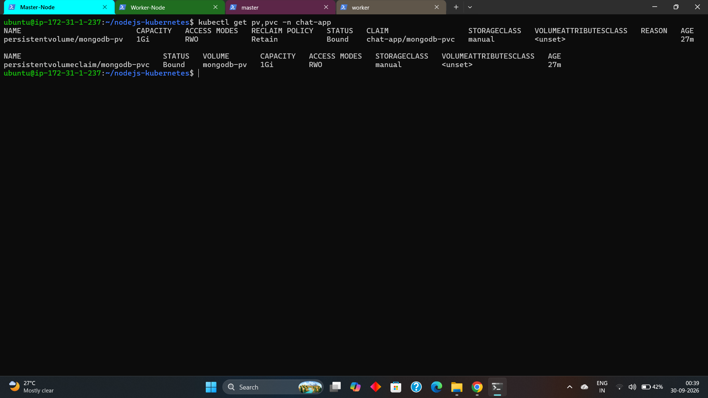
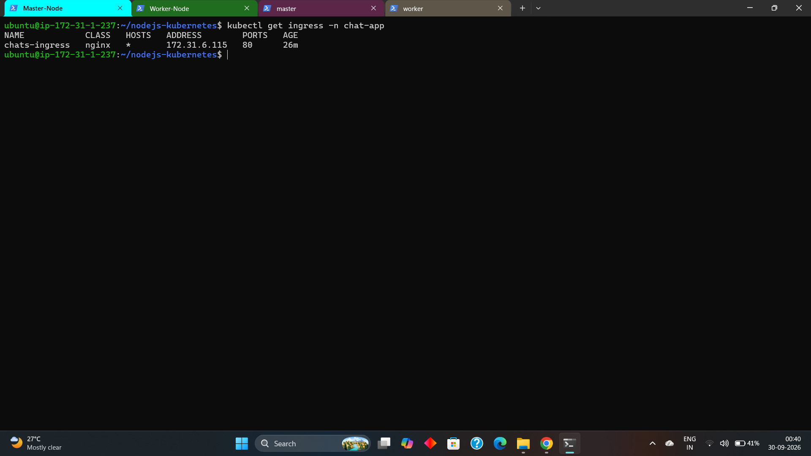
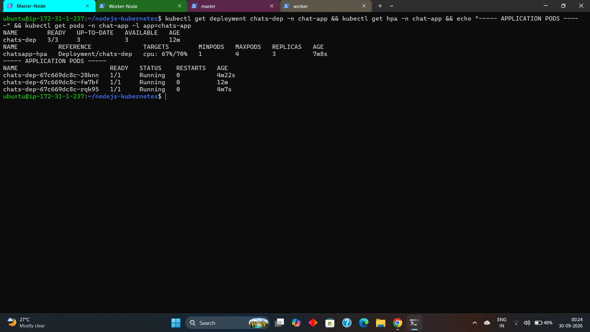
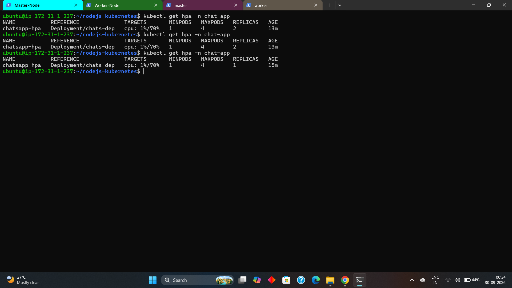

# Node.js Chat Application on Kubernetes

A hands-on Kubernetes portfolio project that deploys a Dockerized Node.js/Express chat application with MongoDB. The project demonstrates application deployment, internal service communication, persistent storage, health checks, NGINX Ingress, resource management, and Horizontal Pod Autoscaling.

## Architecture

```text
Internet
   |
   v
NGINX Ingress Controller
   |
   v
chats-ingress
   |
   v
chats-app-service (ClusterIP)
   |
   v
Node.js Application Pods
   |
   v
mongodb-service (ClusterIP)
   |
   v
MongoDB Pod
   |
   v
mongodb-pvc
   |
   v
mongodb-pv
   |
   v
/mnt/data/mongodb on the worker node
```

## Technologies

- Node.js
- Express.js
- EJS
- Mongoose
- MongoDB
- Docker
- Kubernetes
- NGINX Ingress Controller
- PersistentVolume (PV)
- PersistentVolumeClaim (PVC)
- Horizontal Pod Autoscaler (HPA)
- Kubernetes Metrics Server

## Application Features

The Express application provides basic chat CRUD functionality:

- View chats
- Create a chat
- Edit a chat
- Delete a chat

The application connects to MongoDB through the `MONGO_URL` environment variable.

### Kubernetes Health Endpoints

- `/health` — application health check
- `/ready` — readiness check that also verifies the MongoDB connection

The root route `/` redirects to `/chats`.

## Kubernetes Features

### Namespace

All application resources are deployed in the `chat-app` namespace.

### Node.js Deployment

The Deployment includes:

- Docker container image
- MongoDB connection through an environment variable
- CPU and memory requests
- CPU and memory limits
- Startup probe
- Liveness probe
- Readiness probe

### Kubernetes Services

Two ClusterIP Services are used:

- `chats-app-service` — internal access to the Node.js application
- `mongodb-service` — internal access to MongoDB

### NGINX Ingress

The `/` prefix is routed to the Node.js Service, allowing application routes and static files such as `/style.css` to be served correctly.

### MongoDB Persistent Storage

MongoDB uses a PersistentVolume, PersistentVolumeClaim, and local storage at:

```text
/mnt/data/mongodb
```

The PV uses node affinity so Kubernetes schedules the MongoDB pod on the node where the local storage exists.

> **Note:** This local PV design is intended for this kubeadm learning environment. The database storage is tied to the worker node and is not presented as a production-grade highly available MongoDB architecture.

### Horizontal Pod Autoscaler

The Node.js Deployment is configured with:

- Minimum replicas: 1
- Maximum replicas: 4
- CPU target: 70%

The HPA was tested with artificial CPU load:

```text
1 pod → CPU load → 3 pods
3 pods → CPU load stopped → 2 pods → 1 pod
```

All scaled application pods reached `1/1 Running`.

### Metrics Server

Metrics Server provides CPU metrics for the HPA.

In this kubeadm learning cluster, Metrics Server required the `--kubelet-insecure-tls` option because the kubelet certificates did not contain the expected IP SANs. This is documented as a learning-cluster workaround and should not be treated as a general production security recommendation.

## Kubernetes Manifests

```text
k8s/
├── namespace.yml
├── app-deployment.yml
├── app-service.yml
├── app-ingress.yml
├── mongodb-deployment.yml
├── mongodb-service.yml
├── mongodb-pv.yml
├── mongodb-pvc.yml
└── hpa.yml
```

## Docker

Build the image:

```bash
docker build -t <your-dockerhub-user>/chatapp-img:v1 .
```

Push the image:

```bash
docker push <your-dockerhub-user>/chatapp-img:v1
```

Before deploying, update the image in `k8s/app-deployment.yml`.

Example:

```yaml
image: <your-dockerhub-user>/chatapp-img:v1
```

## Prerequisites

- A working kubeadm-based Kubernetes cluster
- A container runtime such as containerd
- A CNI plugin such as Calico
- NGINX Ingress Controller
- Metrics Server for HPA
- A worker node containing `/mnt/data/mongodb`

## Deployment

### 1. Create the namespace

```bash
kubectl apply -f k8s/namespace.yml
```

### 2. Create MongoDB storage

```bash
kubectl apply -f k8s/mongodb-pv.yml
kubectl apply -f k8s/mongodb-pvc.yml
```

### 3. Deploy MongoDB

```bash
kubectl apply -f k8s/mongodb-deployment.yml
kubectl apply -f k8s/mongodb-service.yml
```

### 4. Deploy the Node.js application

```bash
kubectl apply -f k8s/app-deployment.yml
kubectl apply -f k8s/app-service.yml
```

### 5. Configure Ingress

```bash
kubectl apply -f k8s/app-ingress.yml
```

### 6. Configure HPA

Make sure Metrics Server is available, then:

```bash
kubectl apply -f k8s/hpa.yml
```

## Verify the Deployment

```bash
kubectl get all -n chat-app
kubectl get pv
kubectl get pvc -n chat-app
kubectl get ingress -n chat-app
kubectl get hpa -n chat-app
kubectl top nodes
kubectl top pods -n chat-app
```

Validate the manifests without changing resources:

```bash
kubectl apply --dry-run=client -f k8s/
```

## Useful Commands

View application logs:

```bash
kubectl logs deployment/chats-dep -n chat-app
```

Describe the application pod:

```bash
kubectl describe pod -l app=chats-app -n chat-app
```

Check MongoDB logs:

```bash
kubectl logs deployment/mongodb -n chat-app
```

Check service endpoints:

```bash
kubectl get endpoints -n chat-app
```

## Screenshots

The `screenshots/` directory contains evidence of the deployed application and Kubernetes configuration.

### Application





### Kubernetes Resources



### Persistent Storage



### NGINX Ingress



### HPA Scale-Up

The HPA was tested under CPU load and scaled the Node.js Deployment from 1 to 3 replicas.



### HPA Scale-Down

After the artificial CPU load was stopped, the HPA scaled the application back down to 1 replica.



## What I Practiced

- Deployments and replica management
- Kubernetes Services
- Namespace isolation
- NGINX Ingress
- Startup, liveness, and readiness probes
- CPU and memory resource requests and limits
- Horizontal Pod Autoscaling
- Metrics Server
- PersistentVolumes and PersistentVolumeClaims
- Local persistent storage
- Node affinity
- Docker image deployment
- Application-to-database communication using Kubernetes Services
- Basic Kubernetes troubleshooting
- Kubernetes manifest validation

## Project Structure

```text
nodejs-kubernetes/
├── .dockerignore
├── .gitignore
├── Dockerfile
├── README.md
├── index.js
├── init.js
├── package.json
├── package-lock.json
├── models/
│   └── chat.js
├── public/
│   └── style.css
├── views/
│   ├── edit.ejs
│   ├── index.ejs
│   └── new.ejs
├── screenshots/
│   ├── application-top.png
│   ├── application-bottom.png
│   ├── kubernetes-resources.png
│   ├── storage.png
│   ├── ingress.png
│   ├── hpa-scaling-up.png
│   └── hpa-scale-down.png
└── k8s/
    ├── namespace.yml
    ├── app-deployment.yml
    ├── app-service.yml
    ├── app-ingress.yml
    ├── mongodb-deployment.yml
    ├── mongodb-service.yml
    ├── mongodb-pv.yml
    ├── mongodb-pvc.yml
    └── hpa.yml
```

## Notes

This is a hands-on Kubernetes learning and portfolio project focused on application deployment, networking, storage, health checks, resource management, and autoscaling in a kubeadm-based cluster.

The project intentionally stays focused on core Kubernetes application concepts rather than adding components that are not required by the application.

